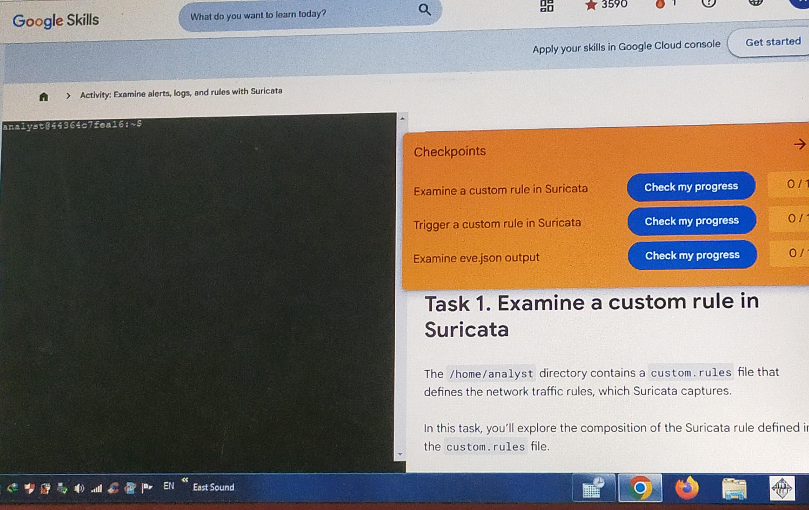
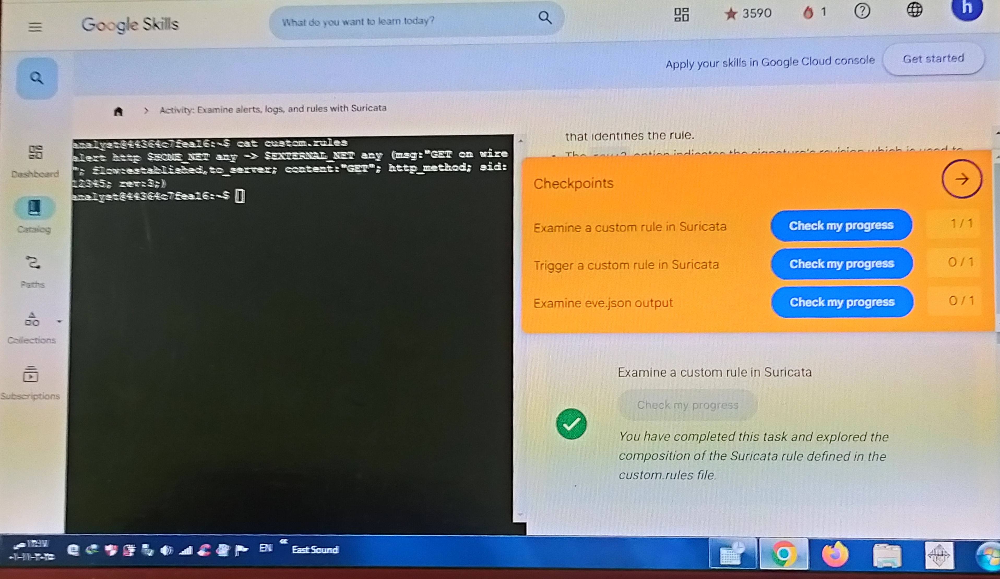

# Suricata_IDS_Segnature_Analysis
Custom Suricata IDS rule creation and log analysis (fast.log &amp; eve.json) Google Cybersecurity Labs

 
 # Suricata Lab (Google Skills)

اللّاب ده كان هدفه إني أشتغل على Suricata IDS وأطبّق شوية مهام على بيئة تجريبية. اتقسم لمجموعة Tasks وكل واحدة كان ليها خطوات لازم أنفذها وأشغّل أوامر معينة، وبعدها أطلع النتائج وأجاوب على الأسئلة.

كل الصور الخاصة بكل خطوة موجودة فى فولدر screenshots.

---

## Task 1: إعداد البيئة وتشغيل Suricata

في المهمة الأولى بدأت أفتح اللاب والبيئة الافتراضية. اتأكدت إن كل حاجة جاهزة وبعدها شغّلت Suricata لأول مرة بالوضع الافتراضي.

كمان اتأكدت إن مفيش errors في الإعداد. وفي الصور هتلاقوا شكل الشاشة في بداية اللاب قبل ما أبدأ أشتغل.

الهدف هنا كان التأكد إن الـ service شغالة كويس قبل أي تعديل.

الصور:
- البيئة الأولية
- اللاب في أول تشغيل

---

## Task 2: تعديل ملف القواعد (custom.rules)

في المهمة دي فتحت ملف custom.rules من المسار الموجود في المشروع. جوه الملف أضفت rule فاضية في الأول للتجربة.

بعد ما كتبت الـ rule حفظت الملف. 
بعدها رجعت أشغّل Suricata على ملف simple.pcap علشان يبدأ يفحص الـ traffic.

بعد ما اشتغل، بصيت في الـ alerts علشان أتأكد إن الـ rule بتاعتي اتفعّلت.

الصور هنا بتوضح:
- قبل تعديل القاعدة
- بعد تعديل القاعدة
- تشغيل Suricata على simple.pcap
- ظهور Alerts

---

## Task 3: أسئلة نظرية على القواعد المفتوحة

في المهمة دي جاوبت على شوية أسئلة مكتوبة في اللاب وكانت أغلبها عن:
- فكرة Open Rules
- البيتات اللي بتتسجل
- كيفية توزيع القواعد

جاوبت عليها بناءً على اللي ظهر في الـ alerts.

الصور:
- صورة توضح إجابة السؤال
- صورة تبين ظهور الـ alerts اللي مبني عليها الإجابة

---

## التحقق النهائي

بعد ما خلصت كل المهام، اتأكدت إن كل Tasks ظهر عليها (✅ Completed) في واجهة Google Skills.

الصور بتوضح:
- أول Task Done
- ثاني Task Done
- Third Task Done
- Completion Final Status

---

## Screenshots

### 1. تجهيز البيئة

### 2. فتح وتعديل القواعد custom.rules

### 3. إتمام المهمة 1

### 4. إتمام المهمة 2

### 5. أسئلة المهمة (جزء 1)

### 6. أسئلة المهمة (جزء 2)

### 7. إتمام المهمة 3

### 8. إكمال اللاب والحصول على الشهادة

## اللي اتعلمته من اللاب

- إزاي أشغل Suricata على pcap file
- فتح وتعديل custom.rules
- ده معناه إن القواعد ممكن نكتبها بإيدينا
- إزاي أقرا alerts اللي بتيجي من Suricata
- إزاي القاعدة بتؤثر على النتائج فعليًا
- إن Suricata ممكن يكون أداة قوية لمراقبة حركة الشبكة في الـ Security

---

## مكان الصور

كل الصور موجودة في فولدر: `screenshots/`
وعنوان كل صورة مكتوب بطريقة توضّح هي خاصة بأي خطوة.
